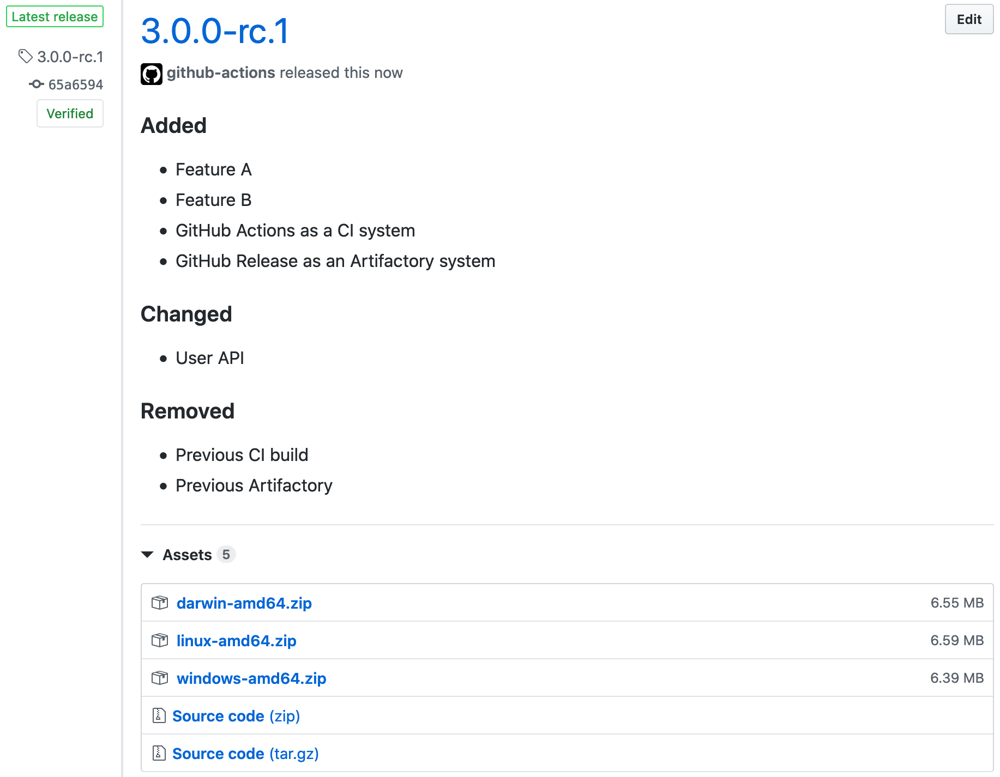

# git-release
[](https://github.com/anton-yurchenko/git-release/releases/latest)
[](https://codecov.io/gh/anton-yurchenko/git-release)
[](https://goreportcard.com/report/github.com/anton-yurchenko/git-release)
[](https://hub.docker.com/r/antonyurchenko/git-release)
[](https://hub.docker.com/r/antonyurchenko/git-release)
[](LICENSE.md)

A GitHub Action for creating a GitHub Release with Assets and Changelog whenever a Version Tag is pushed to the project.  



## Features:
- Parse Tag to match Semantic Versioning.  
- Upload build artifacts (assets) to the release.  
- Add a changelog to the release.  

## Manual:
1. Add your changes to **CHANGELOG.md** in the following format (according to [keepachangelog.com](https://keepachangelog.com/en/1.0.0/ "Keep a ChangeLog")):
```
## [2.0.0] - 2019-12-21 
### Added
- Feature A
- Feature B
- GitHub Actions as a CI system
- GitHub Release as an Artifactory system

### Changed
- User API

### Removed
- Previous CI build
- Previous Artifactory
```
2. Tag a commit with Version (according to [semver.org](https://semver.org/ "Semantic Versioning")).
    - Prefixes like **release-/v/...** are supported.
    - **Postfixes are not supported**.
3. Push and watch **Git-Release** publishing a Release on GitHub ;-)  


## Configuration:
1. Change the workflow to be triggered on Tag Push:
    - Use either `'*'` or a more specific like `'v*'` or `'release-*'`
```
on:
  push:
    tags:
    - 'v*'
```
2. Add Release stage to your workflow:  
    - Customize configuration with env.vars:
        - Provide a list of assets as **args**
        - `DRAFT_RELEASE: "true"` - Save release as draft instead of publishing it (default `false`).
        - `PRE_RELEASE: "true"` - GitHub will point out that this release is identified as non-production ready (default `false`). 
        - `CHANGELOG_FILE: "changes.md"` - Changelog filename (default `CHANGELOG.md`).
        - `ALLOW_EMPTY_CHANGELOG: "true"` - Allow publishing a release without changelog (default `false`).
```
    - name: Release
      uses: docker://antonyurchenko/git-release:latest
      env:
        GITHUB_TOKEN: ${{ secrets.GITHUB_TOKEN }}
        DRAFT_RELEASE: "false"
        PRE_RELEASE: "false"
        CHANGELOG_FILE: "CHANGELOG.md"
      with:
        args: |
          build/release/darwin-amd64.zip
          build/release/linux-amd64.zip
          build/release/windows-amd64.zip
```

## Remarks:
- This action is automatically built at Docker Hub, and tagged with `latest / v2 / v2.0 / v2.0.0`. You may lock to a certain version instead of using **latest**. (*Recommended to lock against a major version, for example* `v2`).
- Instead of using pre-built image, you may build it during the execution of your flow by changing `docker://antonyurchenko/git-release:latest` to `anton-yurchenko/git-release@master`

## License
[MIT](LICENSE.md) © 2019-present Anton Yurchenko